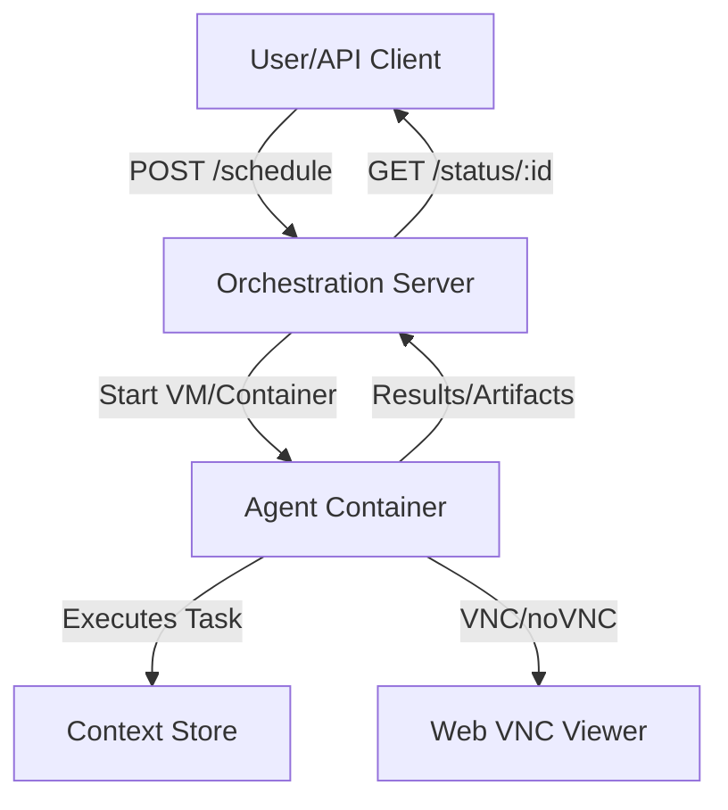

# Design Doc: Coding Agent with Sandboxing and Orchestration

## Overview

This document outlines the architecture and design for a scalable, secure coding agent system capable of executing shell commands, running code (Python, TypeScript, etc.), controlling a GUI via xdot, and managing files—all inside an isolated container. The system includes an orchestration server with REST endpoints to schedule and monitor jobs, and supports advanced context management to work beyond LLM token limits.

---

## 1. Architecture

### High-Level Components

- **Orchestration Server**: Exposes REST API, schedules jobs, manages job lifecycle, and tracks status.
- **Agent Container**: Runs the coding agent, exposes shell/code execution, xdot, and file management tools. Provides VNC/noVNC access for GUI.
- **Context Store**: Persists and prunes context to support long-running jobs and large histories.
- **Job Runner**: Launches each job in an isolated Firecracker VM (or Docker as fallback), ensuring strong sandboxing.

### Diagram



---

## 2. Container Design

### Base Image
- Ubuntu or Debian base
- Installs:
  - Xvfb (virtual display server)
  - xdot (GUI automation)
  - Jupyter Notebook/Lab
  - Python, Node.js, TypeScript, and dev tools
  - noVNC + websockify for browser-based VNC
  - Supervisor or similar to manage all services

### Exposed Ports
- 6080: noVNC (web VNC)
- 8888: Jupyter
- 8000: Agent API (optional, for internal use)

### Security
- Runs as non-root user
- Filesystem access limited to a working directory
- Network egress can be restricted (optional)

---

## 3. Agent Tools

### 1. Shell
- Exposes a secure shell interface (e.g., via REST or websocket)
- Uses seccomp/apparmor and user namespaces for isolation
- Limits available commands and resources

### 2. Code Execution
- Supports Python, TypeScript, etc.
- Uses Jupyter kernel gateway or subprocesses
- Each execution tracked and context-aware

### 3. xdot (GUI Automation)
- Runs inside Xvfb
- Scripts can be sent to xdot for GUI control

### 4. Filesystem
- REST endpoints or internal API for file CRUD
- All file operations restricted to a sandboxed directory

---

## 4. Orchestration Layer

### API Endpoints

#### 1. `POST /schedule`
- **Input**: Plain-text task (e.g., "Build me a todo app in React")
- **Action**: 
  - Generates a unique job ID
  - Launches a Firecracker VM (or Docker container) with the agent
  - Passes the task prompt to the agent
  - Returns `{ job_id: <id> }`

#### 2. `GET /status/:id`
- **Input**: Job ID
- **Output**: JSON with status (`pending`, `running`, `complete`, `error`), and if complete, a download link to the project folder/artifacts

### Job Lifecycle
- Jobs are tracked in a persistent store (e.g., SQLite, Redis, or file-based)
- Each job has a working directory, logs, and output artifacts
- On completion, artifacts are zipped and made available for download

### Scaling
- Orchestrator can run as a stateless service
- Jobs are horizontally scalable (each in its own VM/container)
- Optionally, provide a Kubernetes Job/Pod spec or Nomad job file for cluster deployment

---

## 5. Context Management

### Problem
- LLMs have a context window limit (e.g., 1M tokens)
- Long-running jobs or large codebases exceed this limit

### Solution
- **Persistent Context Store**: All agent state, history, and artifacts are written to disk (or a database) in the job's working directory
- **Pruning**: Only the most relevant context (recent steps, summaries, or embeddings) is loaded into memory for each LLM call
- **Chunking & Summarization**: Large files or histories are chunked and summarized recursively
- **Retrieval**: Use embeddings or keyword search to recall relevant context on demand

---

## 6. Security & Reliability

- All code runs in a minimal, locked-down VM/container
- Resource limits (CPU, memory, disk) enforced per job
- No root access inside containers
- All network/file access logged
- Orchestrator monitors for stuck or runaway jobs and can terminate as needed

---

## 7. Bonus: Kubernetes/Nomad Scaling

- Provide a `job.yaml` (K8s) or `job.hcl` (Nomad) for running agent containers as jobs
- Each job mounts a persistent volume for artifacts
- Orchestrator can submit jobs to the cluster and track their status

---

## 8. Future Improvements

- Add authentication/authorization to API
- Support for more languages/runtimes
- Advanced context retrieval (vector DB, semantic search)
- Web UI for job submission and monitoring

---

## 9. Example Directory Structure

```
project-root/
├── orchestrator/
│   └── server.py
├── agent/
│   ├── Dockerfile
│   ├── entrypoint.sh
│   ├── agent.py
│   └── ...
├── jobs/
│   └── <job_id>/
│       ├── input.txt
│       ├── output.zip
│       └── logs/
└── README.md
```
